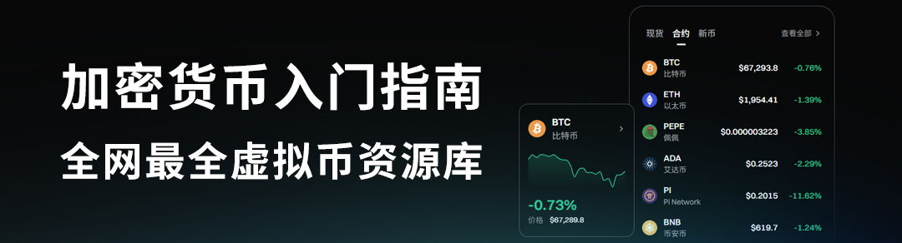
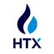
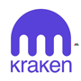

<!DOCTYPE html>
<html lang="zh-CN">
<head>
    <meta charset="UTF-8">
    <meta name="viewport" content="width=device-width, initial-scale=1.0">
    <meta name="description" content="加密货币入门指南,全网最全虚拟币资源库，比特币区块链学习资料，币圈最新最快资讯">
    <meta name="keywords" content="BTC,ETH,BNB,SOL,ADA,doge,加密货币,telegram,币安,欧易,okx,Hyperbot,ByBit,Bitget,Gate,虚拟币,虚拟货币,交易所,比特币,以太坊,狗狗币">
    <meta name="robots" content="index,follow">
    <link rel="canonical" href="币圈赚钱比特币教程">
</head>
<body>
    <!-- 你的页面内容写在这里 -->
</body>
</html>

<h3 align="center">⭐加密货币入门指南,全网最全虚拟币资源库⭐</h3>
<h3 align="center">⭐比特币区块链学习资料，币圈最新最快资讯⭐</h3>

## 📖前言
- 欢迎访问全网全面、专业、实时更新的区块链与加密货币资源平台，本站专为币圈新手、投资者及 Web3 爱好者打造，提供一站式信息整合与实用工具导航服务，助力用户快速入门加密资产世界，轻松掌握行业核心知识与操作技能。 

- 本站汇集主流中心化交易所官方注册链接与正版官网入口，包括币安 Binance、欧易 OKX、预测市场 polymarket、芝麻开门 Gate 等知名交易平台，并提供详细的注册流程、使用教程与安全操作指南，帮助用户安全便捷地使用主流交易服务。 

- 除此之外，平台还全面收录加密货币行业高频实用资源，涵盖实时行情数据分析、巨鲸资金流向监控、NFT 市场行情动态、优质空投项目推送、链上数据查询分析、DeFi 协议介绍与使用教程、DAO 社区运作模式、跨链桥接工具推荐、安全加密钱包选型等内容，全方位满足币圈用户学习、查询、交易与投资需求。 

- 我们始终致力于为广大用户提供最新、最全、最可靠的加密货币工具与学习资料，降低行业信息获取门槛，提升投资与操作安全度。同时欢迎社区用户积极反馈、补充优质资源，与我们共同打造开放、共享、高效的区块链知识与工具库。 

- 关注本站，从零开始系统学习加密资产投资，深入探索 Web3 生态，开启属于你的加密世界探索之旅。 

&nbsp;
&nbsp;

## 🚀科学上网工具

- [vpnnav.github.io](https://vpnnav.github.io)

- 请注意，以上工具仅供学习使用若利用这些工具从事违法犯罪行为，我们概不承担任何法律责任

&nbsp;
&nbsp;

## 📖加密货币交易所
| [ 币安](https://accounts.binance.com/zh-CN/register?ref=FANXIAN) | [ 欧意OKX](https://www.okx.com/zh-hans/join/50253981) |  [ bitget](https://www.bitget.com/zh-CN/referral/register?clacCode=QR4A7MPY) |[ ByBit](https://www.bybit.com/invite?ref=4VLKDMW) | [ 火币](https://www.htx.com.am/invite/zh-cn/1f?invite_code=xpi6a223) |
|:---:|:---:|:---:|:---:|:---:|
| [ CoinBase](https://www.coinbase.com/) | [ kraken海妖](https://www.kraken.com/) | [ KuCoin](https://www.kucoin.com) | [ 抹茶MEXC](https://promote.mexc.com/r/wIE7fPvG) | [ Gate.io](https://www.gatenode.xyz/share/USDTOKOK) |

&nbsp;
&nbsp;

## 💰一定要使用邀请码注册，否则无法减免手续费💰

| 交易所 | 官方链接 | 描述 |
| :---------| :----------| :----------|
| 币安 | [https://www.binance.com](https://accounts.binance.com) | 使用邀请码注册：0000 、减免40%手续费，币安Alpha积分活动，每个月靠空投可以领上万块，有兴趣可以学习下怎么刷[币安刷Alpha积分视频教程](https://www.youtube.com/results?search_query=%E5%B8%81%E5%AE%89alpha) |
| 欧易OKX | [https://www.okx.com](https://www.okx.com) | 使用邀请码注册：0000 、减免30%手续费 |
| ByBit | [https://www.bybit.com](https://www.bybit.com) | 使用邀请码注册：0000 、减免30%手续费 |
| Bitget | [https://www.bitget.com](https://www.bitget.com) | 使用邀请码注册：0000 、减免40%手续费 |
| Gate.io | [https://www.gatesee.com](https://www.gatenode.xyz) | 使用邀请码注册：0000 、减免40%手续费 |
| Hyperbot | [https://hyperbot.network/](https://hyperbot.network/) | 由AI驱动的链上永续合约交易平台 |
| 火币 | [https://www.htx.com](https://www.htx.com) | 使用邀请码注册：0000 、减免30%手续费 |
| 抹茶 | [https://www.mexc.co](https://promote.mexc.com) | 使用邀请码注册：0000 、减免40%手续费 |

&nbsp;
&nbsp;

## 📖Web3资料学习
- [比特币白皮书](https://bitcoin.org/bitcoin.pdf) - Bitcoin: A Peer-to-Peer Electronic Cash System
- [以太坊白皮书](https://ethereum.org/en/whitepaper/) - Ethereum: A Next-Generation Smart Contract and Decentralized Application Platform
- [Uniswap V2 白皮书](https://uniswap.org/whitepaper.pdf) - Uniswap V2 协议设计与原理
- [Uniswap V3 白皮书](https://uniswap.org/whitepaper-v3.pdf) - Uniswap V3 协议设计与改进
- [Bitcoin: A Peer-to-Peer Electronic Cash System](https://bitcoin.org/bitcoin.pdf) - 比特币白皮书：一种点对点的匿名货币交易系统
- [以太坊黄皮书](https://ethereum.github.io/yellowpaper/paper.pdf)
- [区块链黑暗森林自救手册](https://github.com/slowmist/Blockchain-dark-forest-selfguard-handbook/blob/main/README_CN.md) - 慢雾团队编写的区块链安全防护与自救指南

&nbsp;
&nbsp;
## 📖加密货币新闻资讯
- [非小号](https://www.feixiaohao.co/) - 国内行情工具，覆盖币种信息、交易所动态  
- [金十数据](https://www.jin10.com/) - 金十数据致力于成为国内专业的财经新闻软件和交易工具  
- [金色财经](https://www.jinse.cn) - 客观、公正、全面的资讯平台，紧盯互联网技术落地应用、突发事件、热门话题、政策跟进等  
- [CoinMarketCap](https://coinmarketcap.com/zh/) - 最全面的加密货币数据分析平台  
- [Coingecko](https://www.coingecko.com/) - 提供项目评分和综合排序，便于评估项目  
- [比特币巨鲸追踪](https://bitinfocharts.com/zh/top-100-richest-bitcoin-addresses.html) - 追踪比特币前100富有地址   
- [以太坊基金会博客](https://blog.ethereum.org/) - 官方以太坊基金会发布的博客，内容涵盖最新技术和社区动态  
- [coindesk](https://www.coindesk.com/) - 全球领先的加密货币新闻平台，提供行业动态和深度分析  
- [cointelegraph](https://cointelegraph.com/) - 国际区块链和加密货币新闻媒体，提供及时资讯和专题报道  
- [律动](https://www.theblockbeats.info/) - 区块链及数字货币行业信息平台，内容包括行情、深度分析等  
- [PANews - 区块链新闻资讯](https://www.panewslab.com/zh/index.html) - 专业区块链新闻资讯服务平台  

&nbsp;
&nbsp;
## 📖币种官网
- [Bitcoin](https://bitcoin.org) - 比特币官网
- [以太坊](https://ethereum.org) - 以太坊官网
- [USDT](https://tether.to) - USDT官网
- [XRP](https://ripple.com/xrp) - XRP官网
- [Solana](https://solana.com) - SOL币官网
- [Cardano](https://cardano.org) - ADA币官网
- [Dogecoin](https://dogecoin.com) - Dogecoin官网
